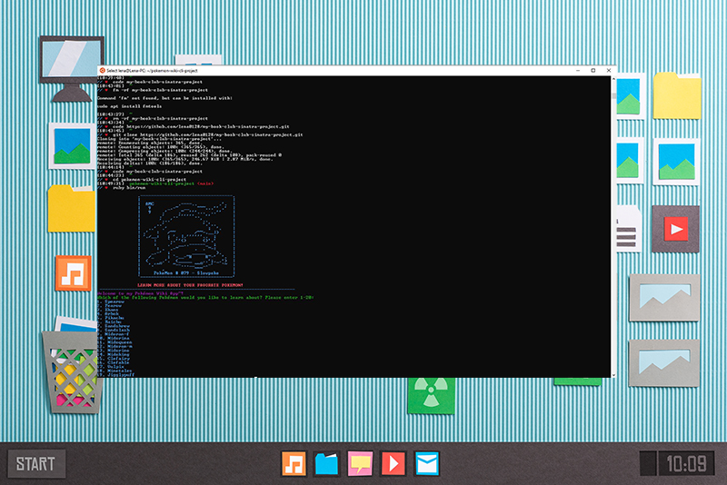

# pokemon-wiki-cli-project

Hi👋! Welcome to my very first cli data project🎉! In this directory, this app provides a CLI to access the data of 20 pokemons fetched from an Pokemon api. It also auto saves the Pokemon the user has just viewed and allows the user to view all the items he or she has learned about. 

## Installation & Usage
$ bundle install

In the directory, simply type the below and follow the on screen prompts.

$ ruby bin/run

## Contributing
Bug reports and pull requests are welcome on GitHub at https://github.com/lena0128/pokemon-wiki-cli-project. This project is intended to be a safe, welcoming space for collaboration, and contributors are expected to adhere to the Contributor Covenant code of conduct.

## Resources
The API used in this project: https://pokeapi.co/api/v2/pokemon/
The ASCII used in this project is from: http://www.ascii-art.de/

## License
The project is available as open source under the terms of the GNU General Public License v3.0 (https://www.gnu.org/licenses/gpl-3.0.en.html).
